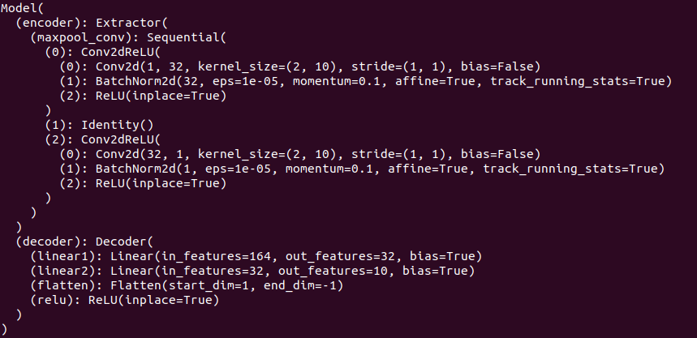
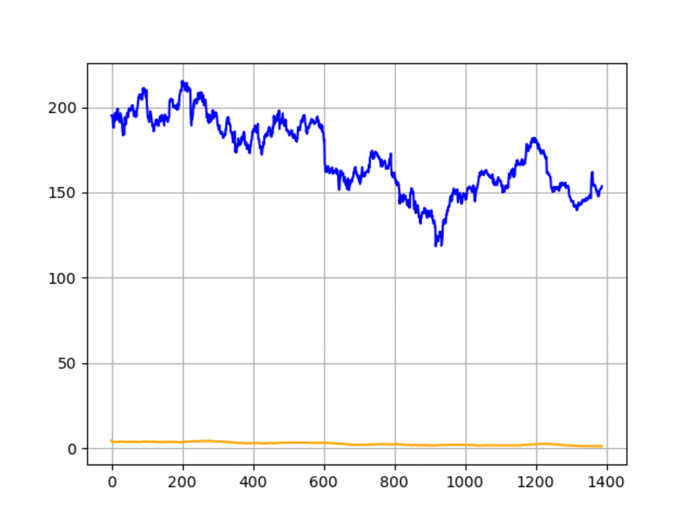

# DSAI HW 2 : stock_trading
Members: 陳香君、方郁文

## Goal 
Predict the "Action to take" in order to "Maximize" the profit you gain in the stock market.<br>
<br>
According to hw2 description<br>
The action should be one of these three types:<br>
1 → means to “Buy” the stock. If you short 1 unit, you will return to 0 as the open price in the next day. If you did not have any unit, you will have 1 unit as the open price in the next day. “If you already have 1 unit, your code will be terminated due to the invalid status.“<br>
<br>
0 → means to “NoAction”. If you have 1-unit now, hold it. If your slot is available, the status continues. If you short 1 unit, the status continues.<br>
<br>
-1 → means to “Sell” the stock. If you hold 1 unit, your will return to 0 as the open price in the next day. If you did not have any unit, we will short 1 unit as the open price in the next day. “If you already short 1 unit, your code will be terminated due to the invalid status.“<br>
<br>
In the final day, if you hold/short the stock, we will force your slot empty as the close price of the final day in the testing period. Finally, your account will be settled and your profit will be calculated.


## How to run
Python Version: 3.6.12
### Args 介紹
```
    '--training':
                    train file path, default training.csv

    '--testing':
                    test file path, default testing.csv
                    
     '--output':
                    output file path, default output.csv

    '--epoch':
                    number of epochs to train, default 30
                       
    '--reference':
                    number of reference days, default 100

    '--forecast':
                    number of predict days, default 10
```
### Execution

Run the command below and will get action of each day

```
python main.py --training training.csv --testing testing.csv --output output.csv
```

## Methods

Implement Convolutional Neural Network as Predictor

- Use `CNN` as encoder(feature extractor) and `torch.nn.Linear` as decoder
- Input `100 or MORE` days of features (Open, High, Low, Close)
- Predict `10 or MORE` days of Open price
<br>
Model Architecture<br>



### Loss

- Ground Truth(GT): `nn.Softmax(open_values_of_forecast)`
- Predict(PR): `nn.Softmax(model.output)`
- Ground Truth Raw(GTR): `open_values_of_forecast`
- Predict Raw(PRR): `model.output`

- loss: `weight_a * nn.BCELoss(GT, PR) + weight_b * nn.MSELoss(GTR, PRR)`

We care more about the "trend" of the stock price instead of the "absolute value", so we apply softmax to "Ground Truth" and "Predict", and use BCE loss to predict the "Trend"<br>
However we still add MSELoss to constrain the predict value<br>
Default `weight_a` and `weight_b` values are `1000` and `0.1` due to balancing reasons.<br>


### Evaluation

#### Kendall tau distance
https://en.wikipedia.org/wiki/Kendall_tau_distance
-  A metric that counts the number of pairwise **disagreements** between two ranking lists.
-  The lower, the better.
-  `#_of_opposite_pairs / total_pairs`

for example:<br>
x1 = [1, 2, 3, 4, 5]
x2 = [6, 7, 8, 9, 10]
x3 = [10, 9, 8, 7, 6]

k(x1, x2) == 0 <br>
k(x1, x3) == 1 <br>
good for predicting trend
 

### Hyper params
Optimizer = Adam<br>
Learning Rate = 3 * 10^-4<br>
Epoches = 30<br>


- Line chart of trading training.csv


### training steps

