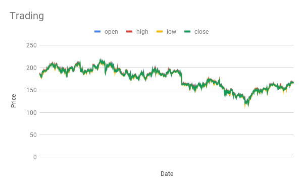

# DSAI HW 2 : stock_trading
Members: 陳香君、方郁文

## Goal 
Predict the operating reserve (備轉容量) value from 2021/03/23 to 2021/03/29.

## How to run
Python Version: 3.6.12
### Args 介紹
```
    '--training':
                    train file path, default training.csv

    '--testing':
                    test file path, default testing.csv
                    
     '--output':
                    output file path, default output.csv

    '--epoch':
                    number of epochs to train, default 30
                       
    '--reference':
                    number of reference days, default 100

    '--forecast':
                    number of predict days, default 10
```
### Execution

Run the command below and will get action of each day

```
python main.py --training training.csv --testing testing.csv --output output.csv
```

## Methods

- Use `CNN` as encoder(feature extractor) and `torch.nn.Linear` as decoder
- Predict `10` days 

### Evaluation

#### Kendall tau distance
-  A metric that counts the number of pairwise **disagreements** between two ranking lists.
-  The lower, the better.

### Training
執行 'run_train.sh'
```
./run_train.sh
```
或執行
```
python app.py --mode train --training dataset/eletricity/2020年度每日尖峰備轉容量率.csv --training2 dataset/eletricity/2021年度每日尖峰備轉容量率.csv --weather_past dataset/weather/weather_day.csv --weather_forecast dataset/weather/weather_forecast.csv --output submission.csv
```

## Dataset
在 Dataset/ 底下有 electricity 和 weather ，以下分別介紹：
1. electricity/ 底下包含 「2020年度每日尖峰備轉容量率.csv」和 「2021年度每日尖峰備轉容量率.csv」<br>
皆是從作業說明中的 "台灣電⼒公司_本年度每⽇尖峰備轉容量率"  下載來的<br>
https://data.gov.tw/dataset/19995
3. weather/ 底下包含 "weather_day.csv" 和 "weather_forecast.csv" <br>
其中"weather_forecast.csv" 來自作業說明中的"未來一週天氣預報"，並加以整理成csv檔案 <br>
而"weather_day.csv"來自"一年觀測資料-局屬地面測站觀測資料"(https://opendata.cwb.gov.tw/dataset/climate/C-B0024-002) <br>
並自行整理成".csv"

## Method
使用Pytorch 進行Deep Learning<br>
搭建Fully connected的Neural Network<br>
```
class LinearModel(nn.Module):
    def __init__(self):
        super(LinearModel, self).__init__()

        self.fc0 = nn.Linear(20, 128)
        self.fc1 = nn.Linear(128, 512)
        self.fc2 = nn.Linear(512, 128)
        self.fc = nn.Linear(128, 7)
        self.flatten = nn.Flatten()

        self.relu = nn.ReLU()

    def forward(self, x):
        x = self.fc0(x)
        x = self.relu(x)
        x = self.fc1(x)
        x = self.relu(x)
        x = self.fc2(x)
        x = self.relu(x)
        x = self.fc(x)

        return x
```

### Input: 
```
concat(10筆電力資料, 10筆天氣資料) 
```
其中，天氣資料以及電力資料日期會錯開
### Output:
未來7天備轉容量(MW)

### training hyperparameters
Loss = Mean Square Error<br>
Optimizer = Adam<br>
Learning Rate = 4 * 10^-4<br>
Epoches = 100<br>

## Predict Example


- Line chart of trading training.csv


